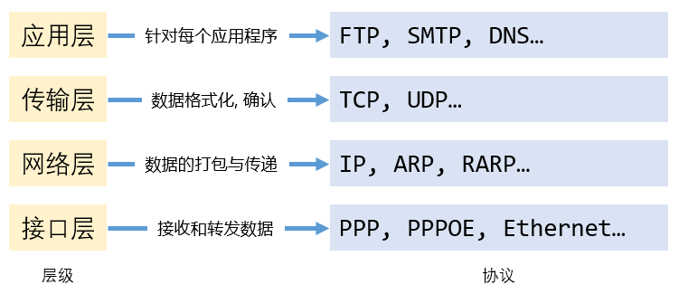

# .NET Core Socket 网络编程, 第〇篇 - 基础

随着计算机网络的日益普及, 各种计算机网络应用程序已渗透到人们生活的方方面面, 因而使得网络程序开发成为了应用程序开发的一个重要方向. 而 .NET Core 是一个通用的开放源代码开发平台, 可以使用多种编程语言针对 *x64*, *x86*, *ARM32* 和 *ARM64* 处理器创建适用于 Windows, macOS 和 Linux 的 .NET Core 应用, 非常适合开发各类网络应用程序.

## 1. 网络通信模型

根据计算机之间数据的通信方式, 可以将通信模型分为 `集中式` 和 `分布式` 两类.

### 1.1. 集中式

在 `集中式` 网络中, 通常由一台主计算机保存和共享数据, 被称为 *服务器*. 其它的计算机通过应用程序连接到服务器上进行数据交换, 这些计算机被称为 *客户端*.

### 1.2. 分布式

`分布式` 网络是由多个连接在一起的计算机组成, 这些计算机之间相互交换数据和分享资源. 在网络中, 它们既作为 *服务器* 向其它计算机提供服务, 也作为 *客户端* 向其它的计算机请求服务.

不同的网络通信模型在物理结构上基本相同, 主要区别是在软件设计层面上.

## 2. 网通通信架构

网络通信架构是计算机应用程序根据网络通信模型的不同而设计的不同的通信架构, 网络通信架构一般分为 `C/S 结构`, `B/S 结构`, `P2P 结构`.

### 2.1. C/S 结构

`C/S 结构` 即客户端 / 服务端结构. 现在大多数应用程序都是这种模型, 它将网络事务的处理部分分为客户端和服务端; 其中客户端主要负责界面显示, 人机交互; 服务端主要负责数据的处理与存储.

### 2.2. B/S 结构

`B/S 结构` 即浏览器 / 服务器结构. `B/S 结构` 是随着互联网技术的发展而对 `C/S 结构` 的改良, 其与 `C/S 结构` 无本质区别, `B/S 结构` 采用 HTTP 协议在客户端和服务端之间进行通信.

### 2.3. P2P 结构

`P2P 结构` 是对等互联的模型. 在 `P2P 结构` 的网络中, 计算机之间具有相同的功能, 无主从之分, 任何一台计算机既是服务端, 也是客户端.

## 3. TCP/IP 网络模型与协议

`TCP/IP 网络模型` 即 Transmission Control Protocol / Internet Protocol (传输控制协议 / 网际协议) 参考模型. 是互联网的基础, 它将网络功能自上而下地划分为 `应用层`, `传输层`, `网络层` 和 `网络接口层`. 每一层的功能由一系列网络协议去实现. 如图所示:

`TCP/IP 网络模型` 采用自顶而下的分层结构, 每一层都依赖于下一层所提供的功能.

- **应用层**, 即最高层. 负责每一个应用程序之间的交流, 例如浏览器与服务器的网站之间采用 HTTP 协议交换数据.

- **传输层**, 管理计算机之间的数据交换, 主要由 `传输控制协议` (TCP) 和 `数据报文协议` (UDP) 实现.

- **网络层**, 负责地址管理与路由选择, 提供最基本的数据打包与传送功能.

- **网络接口层**, 负责字节流与电信号之间的转换, 信号的传输.

## 4. TCP 与 UDP

TCP 和 UDP 协议是 TCP/IP 协议的核心. TCP/IP 协议是一个协议簇, 其中包含了大量的协议, TCP 与 UDP 只是其中的两个. 之所以被称为 **TCP/IP 协议** 是因为这两个协议十分重要, 使用最频繁. 因此就用它俩命名了.

### 4.1. TCP

TCP (传输控制协议) 是一种面向连接的, 可靠的, 基于字节流的通信协议. 面向连接意味着两个使用 TCP 的进程在交换数据之前必须建立连接, 之后才可以传输数据. 主动发起连接建立的进程叫做 `客户 (Client)`, 被动等待连接建立的进程叫做 `服务器 (Server)`.

TCP 采用全双工的数据传输服务, 意味着一旦建立了 TCP 连接的两个进程之间可以同时发送数据和接收数据. 由于一个进程发送的数据, 只能由唯一一个另外的进程接收, 因此 TCP **不**支持 *广播* 和 *组播*.

TCP 为了保证数据传输的准确无误, TCP 将用于传输的数据包分为若干个部分, 然后在它们的首部添加一个检验字节. 当数据的一个部分被接收完毕之后, 服务端会对这一部分的完整性和准确性进行校验, 校验之后如果数据的完整度和准确度都为 100%, 在服务端会要求客户端开始数据下一个部分的传输, 如果数据的完整性和准确性与原来不相符, 那么服务端会要求客户端再次传输这个部分.

TCP 连接面向字节流, 这意味着数据是没有边界的, 比如一个进程通过 TCP 连接发送两个了 512 字节的数据, 另外的接收方进程收到的可能是两个 512 字节数据, 也有可能收到一个 1024 字节数据. 因此, 接收方要准确地检测数据的边界, 必须由发送方和接收方共同商议, 然后应用程序根据约定来实现.

### 4.2. UDP

UDP (用户数据报协议) 是一种面向数据报的传输层协议. 它提供面向无连接的, 不可靠的数据流, 只提供有限的差错校验功能. UDP 只是把数据报发送出去, 但是并不能保证它们能到达目的地. 因此报文可能会丢失, 重复以及乱序等.

UDP 在传输数据报前无需在客户和服务器之间建立一个连接, 所以 UDP 支持广播和组播, 常应用于多媒体应用程序.
