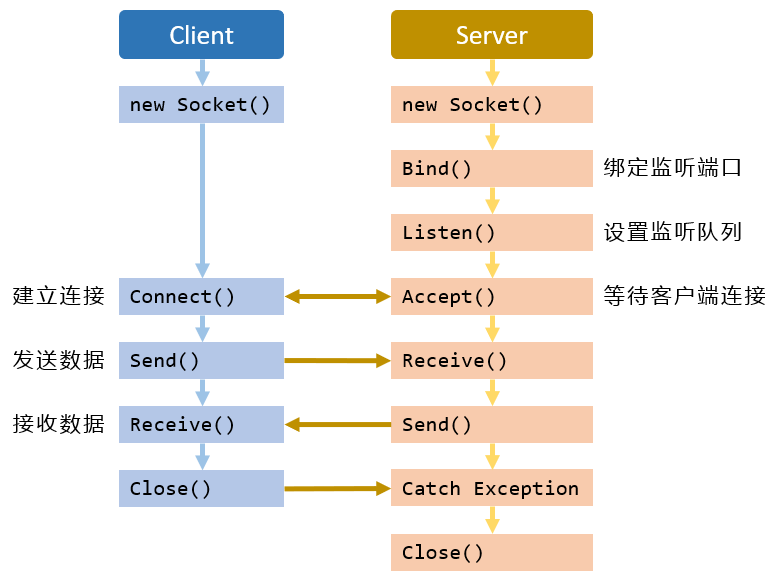

# .NET Core Socket 网络编程, 第三篇 - Socket 详解

如前所述, Socket 是[支持 TCP/IP 网络通信的基本操作单元](dotnet-core-socket-network-programming-01-communication-mechanism.md)¹. 在一个 Socket 的实例中, 不仅仅保存了本机的 IP 地址和端口, 还保存了目标计算机的 IP 地址和端口, 同时还有通信双方所使用的协议.

Socket 可以被视为 Stream 流一样数据管道, 而 Socket 这个管道存在于服务端与客户端的两台计算机之间, 在计算机之间的数据的发送与接收均在于这个管道中进行. 因此, 在应用程序创建好 Socket 对象之后, 就可以用 `Send`/`SendTo` 方法将数据发送到连接的 Socket 中, 或者使用 `Receive`/`ReceiveFrom` 方法从连接的 Socket 对象中接收数据. 如下图所示, 展示了客户端与服务端进行通信的一般过程:



## 1. Socket 类的类型

Socket 有三种类型, 分别是 `Stream Socket` (流 Socket); `Dgram Socket` (数据报 Socket); `Raw Socket` (原始 Socket).

- **Stream Socket** 用于实现 TCP 通信, 它面向连接, 传输的数据是可靠无差错且无重复, 发送和接收数据的顺序是相同的.

- **Dgram Socket** 用于实现 UDP 通信, 它面向 **无** 连接, 以独立的 Dgram 形式发送数据 (数据包尺寸不能大于 32KB), 无容错检查, 也不保证收发顺序.

- **Raw Socket** 用于实现 IP 数据包通信, 直接访问最底层. 常用于侦听与分析数据包.

在 .NET Core 中, 以上三种类型的 Socket 均可使用命名空间 `System.Net.Sockets` 中的 `Socket` 类实现. `Socket` 类构造函数如下:

```cs
public Socket(AddressFamily addressFamily, SocketType socketType, ProtocolType protocolType);
```

- `addressFamily` 参数指定 `Socket` 类使用的寻址方案:
  
  - `AddressFamily.InterNetwork` 代表了 IP 版本 4 (IPv4) 的地址;
  - `AddressFamily.InterNetworkV6` 代表了 IP 版本 6 (IPv6) 的地址.

- `socketType` 参数指定 `Socket` 类的类型:
  
- `protocolType` 参数指定 `Socket` 使用的协议.

`socketType` 参数与 `protocolType` 参数的枚举值不是独立的, 必须搭配使用. 某些地址族限制了可与它们一起使用的协议, 如果地址族, Socket 类型和协议类型的组合导致无效 Socket, 则此构造函数将引发一个 `SocketException`. 以下表格列出了这两个参数的组合:

| `socketType`        | `protocolType`      | 说明                        |
| ------------------- | ------------------- | --------------------------- |
| `SocketType.Stream` | `ProtocolType.Tcp`  | 面向连接, 可靠的通信.       |
| `SocketType.Dgram`  | `ProtocolType.Udp`  | 无连接, 不可靠的通信.       |
| `SocketType.Raw`    | `ProtocolType.Icmp` | 使用 Internet 控制消息协议. |
| `SocketType.Raw`    | `ProtocolType.Igmp` | 使用 Internet 组管理协议.   |

示例:

```cs
/** 基于 TCP 的 IPv4 的面向连接的 Socket. */
Socket socket = new Socket(AddressFamily.InterNetwork, SocketType.Stream, ProtocolType.Tcp);
```

上述代码创建了一个支持可靠, 双向, 基于连接的字节流. 而不重复数据, 也不保留边界. 此类型的 Socket 与单个对方主机通信, 并且在通信开始之前需要建立远程主机连接.

```cs
/** 基于 UDP 的 IPv4 的无连接的 Socket. */
Socket socket = new Socket(AddressFamily.InterNetwork, SocketType.Dgram, ProtocolType.Udp);
```

上述代码创建了一个无连接, 支持数据报的 Socket. 消息可能会丢失或重复并可能在到达时不按顺序排列, 可以与多个对方主机进行通信.

## 脚注

[1] 如果未阅读之前的文章, 请至少阅读 [第一篇 - 网络应用程序通信机制](dotnet-core-socket-network-programming-01-communication-mechanism.md) 的第二小节: Socket (套接字) 与第三小节: 基于 Socket 的通信机制.
