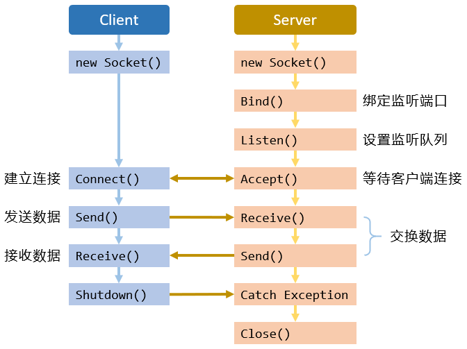

# .NET Core Socket 网络编程, 第四篇 - 面向有连接的网络编程初窥: 使用 TCP

TCP (传输控制协议) 是基于建立连接的 Socket 而进行通信. 在本篇将演示如何使用 Socket 在两个 IP 终结点之间建立连接, 并相互发送消息. 如下图所示, 展示了客户端与服务端基于连接的通信的一般过程:



客户端和服务端两边的步骤有所差异, 根据面向连接的 Socket 通信流程图, 总结基本步骤如下:

- 服务端:
  
  1. 创建服务端 Socket 对象.
  2. 绑定 IP 终结点.
  3. 开启监听.
  4. 等待客户端连接.
  5. 接收客户端连接.
  6. 收发数据.
  7. 释放连接.

- 客户端:

  1. 创建客户端 Socket 对象.
  2. 连接服务端终结点.
  3. 收发数据.
  4. 释放连接.

## 服务端实现

  1. 新建一个服务端 Socket 对象, 用于绑定和监听客户端发起的连接.
  2. 新建一个 IP 终结点, 其中包含了服务端的 IP 地址和端口. 然后服务端 Socket 对象使用 `Bind` 方法绑定它.
  3. 服务端 Socket 对象调用 `Listen` 方法, 服务端开启监听.
  4. 服务端 Socket 对象调用 `Accept` 方法, 等待客户端的连接. 此时, 将一直处于阻塞状态, 直到有新的客户端连接.
  5. 一旦有客户端连接到服务端, `Accept` 方法将创建一个新的 Socket 对象, 它包含了服务端/客户端的信息和协议.
  6. 使用 `Accept` 方法新建的 Socket 对象调用 `Receive` 或 `Send` 方法和客户端通信.
  7. 使用结束之后断开连接, 并释放 Socket.

实现代码:

```cs
// 服务端
static void Main(string[] args)
{
    /**
     * 1. 新建一个服务端 Socket 对象, 用于绑定和监听客户端发起的连接.
     *
     *    面向连接的 Socket 的类型为 Stream, 协议类型为 Tcp.
     */
    Socket serverSocket = new Socket(AddressFamily.InterNetwork, SocketType.Stream, ProtocolType.Tcp);

    /**
     * 2. 新建一个 IP 终结点, 其中包含了服务端的 IP 地址和端口. 然后服务端 Socket 对象使用 `Bind` 方法绑定它.
     *
     *    演示程序, 绑定本机回环地址, 并监听 50000 端口.
     */
    serverSocket.Bind(new IPEndPoint(IPAddress.Loopback, 50000));

    /**
     * 3. 服务端 Socket 对象调用 `Listen` 方法, 服务端开启监听.
     *
     *    开启监听, 指定最大连接数是 10.
     */
    serverSocket.Listen(10);

    /**
     *   4. 服务端 Socket 对象调用 `Accept` 方法, 等待客户端的连接. 此时, 将一直处于阻塞状态, 直到有新的客户端连接.
     *   5. 一旦有客户端连接到服务端, `Accept` 方法将创建一个新的 Socket 对象, 它包含了服务端/客户端的信息和协议.
     *
     *      等待客户端连接.
     */
    Socket clientSocket = serverSocket.Accept();

    /**
     * 6. 使用 `Accept` 方法新建的 Socket 对象调用 `Receive` 或 `Send` 方法和客户端通信.
     *
     *    发送数据.
     */
    string message = "来自服务端消息: hello";
    clientSocket.Send(Encoding.UTF8.GetBytes(message));

    /**
     *    接收数据.
     */
    byte[] data = new byte[1024];
    clientSocket.Receive(data);

    /**
     * 使用结束之后断开连接, 并释放 Socket.
     */
    clientSocket.Shutdown(SocketShutdown.Both);
    clientSocket.Close();
}
```

*注: 限篇幅, 文中所示代码均已去掉额外代码, 仅含核心代码, 完整代码参见文章相对应的项目.*

## 客户端实现

  1. 新建一个客户端 Socket 对象, 用于连接服务端.
  2. 使用 `Connect` 方法连接服务端的 IP 终结点.
  3. 调用 `Receive` 或 `Send` 方法和服务端进行通信.
  4. 使用结束之后断开连接, 并释放 Socket.

实现代码:

```cs
// 客户端
static void Main(string[] args)
{
    /**
     * 1. 新建一个客户端 Socket 对象, 用于连接服务端.
     */
    Socket clientSocket = new Socket(AddressFamily.InterNetwork, SocketType.Stream, ProtocolType.Tcp);

    /**
     * 2. 使用 `Connect` 方法连接服务端的 IP 终结点.
     */
    clientSocket.Connect(new IPEndPoint(IPAddress.Loopback, 50000));

    /**
     * 3. 调用 `Receive` 或 `Send` 方法和服务端进行通信.
     */
    byte[] data = new byte[1024];
    clientSocket.Receive(data);

    var message = "来着客户端消息: world";
    clientSocket.Send(Encoding.UTF8.GetBytes(message));

    /**
     * 4. 使用结束之后断开连接, 并释放 Socket.
     */
    clientSocket.Shutdown(SocketShutdown.Both);
    clientSocket.Close();
}
```

*注: 限篇幅, 仅含核心代码.*

首先运行服务端程序等待客户端连接, 之后再运行客户端程序去连接服务端. 双方在交换数据之后, 就各自退出了.

## 为了接收多个客户端

上述服务端的代码在仅仅接收到 **一次** 客户端的连接之后, 相互交换了数据就退出了. 现在有个想法是, 服务端完成之后不要退出了, 在与一个客户端交换完成数据之后, 服务端继续等待下一个客户端连接, 再相互交换数据. 为了实现这个想法, 适当地调整下服务端的代码 -- 添加了一个无限循环.

实现代码:

```cs
// 服务端
static void Main(string[] args)
{
    Socket serverSocket = new Socket(AddressFamily.InterNetwork, SocketType.Stream, ProtocolType.Tcp);

    serverSocket.Bind(new IPEndPoint(IPAddress.Loopback, 50000));
    serverSocket.Listen(10);

    // 使用循环反复接收客户端.
    while (true)
    {
        Socket clientSocket = serverSocket.Accept();

        string message = "来自服务端消息: hello";
        clientSocket.Send(Encoding.UTF8.GetBytes(message));

        byte[] data = new byte[1024];
        clientSocket.Receive(data);

        clientSocket.Shutdown(SocketShutdown.Both);
        clientSocket.Close();
    }
}
```

*注: 限篇幅, 后续代码中的已注释的说明将移除, 仅保留新增代码的注释.*

## 为了接收多批数据

现在经过改良的服务的代码有了反复接收客户端连接的能力, 即, 在某个客户端连接上通信完成之后, 服务端还能接收新的客户端连接. 但是有两个缺陷:

现在客户端和服务端传输的数据量被约定在 1024 字节. 如果客户端有个数据块比较大, 比如视频文件, 传输给服务端的时候就产生问题了. 服务端由于事先编写程序的时候并不知道将来使用的数据块尺寸到底有多大, 若服务端接收容器设计的太大, 会造成内存浪费, 设计的太小, 又接收不下太大的数据.

为了解决无法接收大文件的缺陷, 客户端认为将要传输的数据太大, 需要分批多次传输. 即, 客户端多次调用 `Send` 方法向服务端发送数据. 此时的服务端程序就有了新的问题, 因为服务端的代码在接收到一次数据之后就关闭连接了. 现在, 调整代码解决这个问题.

首先调整下客户端的代码, 模拟数据量太大, 需要多次调用 `Send` 方法发送:

```cs
// 客户端
static void Main(string[] args)
{
    Socket clientSocket = new Socket(AddressFamily.InterNetwork, SocketType.Stream, ProtocolType.Tcp);

    clientSocket.Connect(new IPEndPoint(IPAddress.Loopback, 50000));

    byte[] data = new byte[1024];
    clientSocket.Receive(data);

    const int count = 10;

    // 多次向服务端发送数据.
    for (int i = 0; i < count; i++)
    {
        // 每次发送都延迟 1 秒, 放缓发送速度.
        Task.Delay(TimeSpan.FromSeconds(1)).Wait();

        var message = "来着客户端消息: world";
        clientSocket.Send(Encoding.UTF8.GetBytes(message));
    }

    clientSocket.Shutdown(SocketShutdown.Both);
    clientSocket.Close();
}
```

然后再调整服务端的代码, 以支持当客户端发送了许多数据亦能正确接收.

```cs
// 服务端
static void Main(string[] args)
{
    Socket serverSocket = new Socket(AddressFamily.InterNetwork, SocketType.Stream, ProtocolType.Tcp);

    serverSocket.Bind(new IPEndPoint(IPAddress.Loopback, 50000));
    serverSocket.Listen(10);

    // 使用循环反复接收客户端.
    while (true)
    {
        Socket clientSocket = serverSocket.Accept();

        string message = "来自服务端消息: hello";
        clientSocket.Send(Encoding.UTF8.GetBytes(message));

        // 反复多次接收客户端发送的数据.
        while (true)
        {
            byte[] data = new byte[1024];

            var length = clientSocket.Receive(data);
            var result = Encoding.UTF8.GetString(data, 0, length);

            if (string.IsNullOrEmpty(result))
            {
                clientSocket.Shutdown(SocketShutdown.Both);
                clientSocket.Close();
                break;
            }
        }
    }
}
```

## 使用多线程

至此, 通过上面的步骤, 得到了一个运行良好的面向连接的网络通信程序. 然而, 在实际的应用场景中服务端会接收到大量的请求, 常常是多个客户端同时请求连接服务端, 但上述服务端的代码即使经过改良, 亦是同时仅仅支持只有一个客户端的连接, 此时可借助多线程技术再次改良上述服务端代码, 以实现同时与多个客户端通信.

## 如果双方的缓冲区大小不匹配

## 如果双方的处理速度不一致

## "粘包" 与 "丢包"

## 总结
