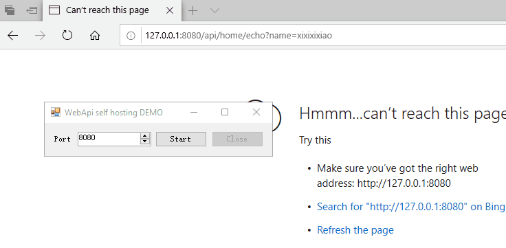
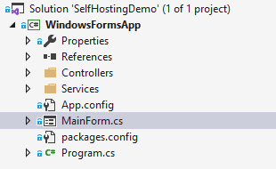
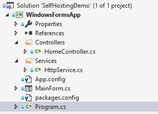

# 实现 WebApi 自托管服务宿主于 WinForms 及其交互

在 Windows 平台 Web 服务一般托管于 IIS. 在开发中, 会遇到 WinForms 或 WPF 服务端程序需要提供对外 API 作为服务. 在本文详细介绍 WebApi 自托管于 WinForms 中, WPF 或 Console 程序实现类似.

## 0. 完整示例演示



## 1. 新建解决方案以及 WinForms 工程

### 1.1. 新建解决方案及工程

如下图所示:



- 建立空白解决方案及 Winforms 工程,
- 新建 `Controllers` 文件夹用于存放 WebApi 代码,
- 新建 `Services` 文件夹用于存放服务代码.

### 1.2. 拖拽控件

绘制必要控件, 布局如下:


备注: 绘制一个 NumericUpDown 和两个 Button 控件.

### 1.3. 引用相关 NuGet 包

- `Microsoft.AspNet.WebApi.Client`
- `Microsoft.AspNet.WebApi.Core`
- `Microsoft.AspNet.WebApi.SelfHost`

## 2. 开发 HTTP 服务类

```csharp
/// <summary>
/// HTTP service.
/// </summary>
public class HttpService : IDisposable
{
    /// <summary>
    /// HTTP server's listening port.
    /// </summary>
    public int Port { get; set; }

    /// <summary>
    /// HTTP self hosting.
    /// </summary>
    private readonly HttpSelfHostServer _server;

    /// <summary>
    /// HTTP server.
    /// </summary>
    /// <param name="port">Listening port.</param>
    public HttpService(int port)
    {
        this.Port = port;

        var config = new HttpSelfHostConfiguration($"http://0.0.0.0:{this.Port}");

        config.MapHttpAttributeRoutes();
        config.Routes.MapHttpRoute("DefaultApi", "api/{controller}/{action}");

        _server = new HttpSelfHostServer(config);
    }

    #region HTTP Service

    /// <summary>
    /// start HTTP server.
    /// </summary>
    public Task StartHttpServer()
    {
        return _server.OpenAsync();
    }

    /// <summary>
    /// Close HTTP server.
    /// </summary>
    public Task CloseHttpServer()
    {
        return _server.CloseAsync();
    }

    #endregion

    /// <summary>
    /// Performs application-defined tasks associated with freeing, releasing, or resetting unmanaged resources.
    /// </summary>
    public void Dispose()
    {
        _server?.Dispose();
    }
}
```

WebApi 自托管服务主要由 `HttpSelfHostServer` 实现, 其 `OpenAsync` 方法开启 HTTP 监听, `CloseAsync` 方法关闭 HTTP 监听.

```csharp
config.MapHttpAttributeRoutes();
```

可以在 `Controller` 中使用路由特性.

## 3. 调用 HTTP 服务

在 MainForm 窗体程序中引用 HTTP 服务:

```csharp
public class MainForm:Form
{
    /// <summary>
    /// Http service.
    /// </summary>
    private HttpService _http;
}
```

### 3.1. 编写开启 HTTP 服务代码

```csharp
/// <summary>
/// start the http server.
/// </summary>
private async void StartButton_Click(object sender, EventArgs e)
{
    /**
     * start.
     */
    try
    {
        var port = Convert.ToInt32(this.PortNum.Value);

        /**
         * initialize http service.
         */
        _http = new HttpService(port);

        await _http.StartHttpServer();
    }
    catch (Exception exception)
    {
        MessageBox.Show($"{exception.Message}", "Error", MessageBoxButtons.OK, MessageBoxIcon.Error);
    }
}
```

### 3.2. 编写关闭 HTTP 服务代码

```csharp
/// <summary>
/// close the http server.
/// </summary>
private async void CloseButton_Click(object sender, EventArgs e)
{
    /**
     * close.
     */
    try
    {
        await _http.CloseHttpServer();
        _http.Dispose();
    }
    catch (Exception exception)
    {
        MessageBox.Show($"{exception.Message}", "Error", MessageBoxButtons.OK, MessageBoxIcon.Error);
    }
}
```

## 4. 开发控制器

```csharp
/// <summary>
/// Home controller.
/// </summary>
[RoutePrefix("api/home")]
public class HomeController : ApiController
{
    /// <summary>
    /// Print the greetings
    /// </summary>
    /// <param name="name">visitor</param>
    /// <returns>greetings</returns>
    [Route("echo")]
    [HttpGet]
    public IHttpActionResult Echo(string name)
    {
        return Json(new {Name = name, Message = $"Hello, {name}"});
    }
}
```

## 5. 合在一起



[下载完整示例代码 (GitHub)](https://github.com/xixixixixiao/xiao-blog/tree/master/solutions/SelfHostingDemo)

## 6. 注意事项

程序需要拥有 **管理员权限** 才能开启 HTTP 监听, 在调试时, 若 Visual Studio 为拥有管理员权限, 则无法正常运行. 同样地, 在程序编译生成之后运行时亦需要权限.
