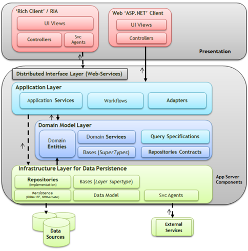

# 应用领域驱动设计, 第一章 - 基础 Applied Domain-Driven Design (DDD), Part 1 - Basics

> When I started learning domain-driven design there was a lot of theory to take in, Eric Evans did a great job explaining it from theoretical point of view. As a software engineer I wanted to see some code and just to follow some examples, I found very little resource out there that showed applied domain-driven design in C#.

当我开始学习领域驱动设计时, 有大量的理论需要吸收, Eric Evans 从理论的视角做了非常好的解释. 作为一个软件开发者我想查看一些代码和效仿一些示例, 但是仅找到很少资源用 C# 去展示领域驱动设计的应用.

> Over the coming weeks I will be posting series of articles on the subject, it will be my attempt to make domain-driven design simpler and easier follow. Articles that are published:

接下来的几周 (作者是在 2013 年 09 月写下这一系列文章的) 我将会发表关于这个主题的一系列文章, 我将尝试让领域驱动设计更简单和更容易理解. 这系列的文章在这里:

- [应用领域驱动设计, 第〇章 - 需求和建模](applied-domain-driven-design-ddd-part-0.md)
- [应用领域驱动设计, 第一章 - 基础](applied-domain-driven-design-ddd-part-1.md)
- [应用领域驱动设计, 第二章 - Domain events](http://www.zankavtaskin.com/2013/09/applied-domain-driven-design-ddd-part-2.html)
- [应用领域驱动设计, 第三章 - Specification Pattern](http://www.zankavtaskin.com/2013/10/applied-domain-driven-design-ddd-part-3.html)
- [应用领域驱动设计, 第四章 - Infrastructure](http://www.zankavtaskin.com/2013/11/applied-domain-driven-design-ddd-part-4_16.html)
- [应用领域驱动设计, 第五章 - Domain Service](http://www.zankavtaskin.com/2013/11/applied-domain-driven-design-ddd-part-4.html)
- [应用领域驱动设计, 第六章 - Application Services](http://www.zankavtaskin.com/2013/11/applied-domain-driven-design-ddd-part-4.html)
- [应用领域驱动设计, 第七章 - Read Model](http://www.zankavtaskin.com/2016/06/applied-domain-driven-design-ddd-part-7.html)
- [应用领域驱动设计, My Top 5 Best Practices](https://www.codeproject.com/Articles/1131462/Domain-Driven-Design-My-Top-Best-Practices)
- [应用领域驱动设计, Event Logging & Sourcing For Auditing](http://www.zankavtaskin.com/2016/08/applied-domain-driven-design-ddd-event.html)



*领域驱动设计架构 (这看起来比较简单) [Domain Driven Design Architecture (it's simpler then it looks)]*

## 1. 在开始之前让我们看看为什么领域驱动设计如此出色 (Before we get started let's see why DDD is so great)

> - **Development** becomes domain oriented not UI/Database oriented

- **开发** 转变向面向领域而非面向 UI 或数据库开发.

> - **Domain layer** captures all of the business logic, making your service layer very thin i.e. just a gateway in to your domain via DTO's

- **领域层** 捕获了所有的业务逻辑, 让你的服务层十分轻薄精简, 即只是领域的一个网关, 仅仅让数据传输对象 (DTO) 通过.

> - **Domain oriented development** allows you to implement true service-oriented architecture i.e. making your services reusable as they are not UI/Presentation layer specific

- **面向领域的开发** 让你实现真正的面向服务架构, 即让你的服务可重用化; 因为它们不是特定于 UI 或表示层.

> - **Unit tests** are easy to write as code scales horizontally and not vertically, making your methods thin and easily testable

- **单元测试** 更容易编写. 因为代码是水平扩展, 而非垂直扩展. 让你的方法轻薄且易于测试.

> - **DDD** is a set of Patterns and Principles, this gives developers a framework to work with, allowing everyone in the development team to head in the same direction

- **领域驱动设计** 一组模式和原则, 为开发者提供了一套可用框架, 使开发团队的每一位开发者向着共同的方向前进.

> Through this series of articles I will be focusing on a simple and made up e-commerce domain.

通过这个系列的文章, 我会重点介绍一个简单且虚构的电子商城领域.

## 2. 让我们来瞧一些代码 (So, let's see some code)

```csharp
public class Product
{
    public Guid Id { get; set; }
    public string Name { get; set; }
    public int Quantity { get; set; }
    public DateTime Created { get; set; }
    public DateTime Modified { get; set; }
    public bool Active { get; set; }
}

public class Customer
{
    public Guid Id { get; set; }
    public string FirstName { get; set; }
    public string LastName { get; set; }
    public string Email { get; set; }
    public List Purchases { get; set; }
}

public class Purchase
{
    public Guid Id { get; set; }
    public List Products { get; set; }
    public DateTime Created { get; set; }
    public Customer Customer { get; set; }
}
```

> Code above represents anemic classes. Some developers would stop here, and use these classes to pass data to service and then bind this data to the UI. Let's carry on and mature our models.

以上的代码表示了几个贫血类. 有些开发者到这步就停下来了, 然后用这些类传输数据给服务和绑定数据给 UI. 现在, 让我们的模型继续成熟下去.

> When a customer shops online they choose items first, they browse around, and then eventually they will make a purchase. So we need something that will hold the products, lets call it a Cart, this object will have no identity and it will be transient.

当一个客户现在购物时, 他们会先选择商品, 然后再浏览这件商品, 最后他们才将购买. 所以, 我们需要某个东西去持有商品, 我们把这个东西叫做购物车, 这个对象是没有 Id 且仅临时的.

## 3. 购物车是我的值对象 (Cart is my value object)

```csharp
public class Cart
{
    public List Products { get; set; }
}
```

> Cart simply contains a list of products. Customer can go ahead and checkout these products when they are ready.

购物车仅包含了一个产品的列表. 当客户已经挑选好产品时, 之后就可以继续结账了.

> We can use what was said above as a business case "Customer can go ahead and checkout these products when they are ready".

我们可将上述的情形: "当客户已经挑选好产品时, 之后就可以继续结账了" 作为一个业务.

## 4. 代码如下所示 (Code would look like)

```csharp
Cart cart = new Cart()
{
    Products = new Product[]
    {
        new Product(),
        new Product()
    }
};

Customer customer = new Customer()
{
    FirstName = "Josh",
    LastName = "Smith"
};

Purchase purchase = customer.Checkout(cart);
```

> What's going on here? Customer checks-out the product and gets a purchase back. Normally in business context you get a receipt back, this provides basic information about the purchase, discounts, and acts as a guarantee that i can use to refer back to my purchase.

观察现在的变化; 客户对购物车里的商品进行结账, 然后获得了订单. 在业务上下文中, 通常会收到回执; 此回执提供了有关订购, 折扣等基础信息; 还能作为我的购物的凭证的参考.

> I could rename Purchase to Receipt, but wait, what's does purchase mean in the business context?

我可以把 `购置` 重命名为 `收据`, 但是, 稍等下, `购置` 在业务上下文的含义是什么?

> *"to acquire by the payment of money or its equivalent; buy."* - Dictionary.com

*"以付款或等值的方式获得; 购买."* - Dictionary.com

> (Returning purchase object would make sense if customer actually made a purchase i.e. we pre-authenticated a customer and then simply passed payment authentication code to the checkout, but to keep this simple we are not going to do this)

> Customer can now checkout, when they checkout they will get back a Purchase object (this will allow further data manipulation).

> Code above needs to be re-factored, if we return back a purchase are we going to then add it to the collection of the customer i.e. Customer.Purchases.Add(...)? This seems strange, if we have a method Customer.Checkout(...) we should aim to capture relevant data right there and then. Customer should only expose business methods, if we have to expose something else in order to capture data then we are not doing it right.

## 5. 让我们更进一步改善 (Lets refine further)

```csharp
public class Customer
{
    public Guid Id { get; set; }
    public string FirstName { get; set; }
    public string LastName { get; set; }
    public string Email { get; set; }
    public List Purchases { get; set; }

    public Purchase Checkout(Cart cart)
    {
        Purchase purchase = new Purchase()
        {
             Customer = this,
             Products = cart.Products,
             Created = DateTime.Now
        };

        this.Purchases.Add(purchase);
        return purchase;
    }
}
```

> Ok, so now when customer checks-out a cart, purchase will be added to the purchase collection and also returned  so it can be used further in our logic. This is great, but another software engineer can go in and compromise our domain. They can just add Orders directly to the customer without checking out i.e. Customer.Orders.Add(...).

## 6. 让我们更进一步改善 (Lets refine further)

```csharp
public class Customer
{
    private List purchases = new List();

    public Guid Id { get; set; }
    public string FirstName { get; set; }
    public string LastName { get; set; }
    public string Email { get; set; }
    public ReadOnlyCollection Purchases { get { return this.purchases.AsReadOnly(); } }

    public Purchase Checkout(Cart cart)
    {
        Purchase purchase = new Purchase()
        {
             Customer = this,
             Products = cart.Products,
             Created = DateTime.Now
        };
        this.purchases.Add(purchase);
        return purchase;
    }
}
```

> Now orders can't be compromised, and code forces software engineers to checkout a cart. What about other properties? They are not protected. We know customer state can't just be changed, we have to go through a process. You need to ask your self, when personal information is changed on the customer, do we need to send an email out? Do we need to call some 3rd party API to sync up our records? Right now you might not have a requirement from your business analysts to do anything like this, so lets not worry about it, lets just protect these fields so they can't be changed.

```csharp
public class Customer
{
    private List purchases = new List();

    public Guid Id { get; protected set; }
    public string FirstName { get; protected set; }
    public string LastName { get; protected set; }
    public string Email { get; protected set; }
    public ReadOnlyCollection Purchases { get { return this.purchases.AsReadOnly(); } }
    public Purchase Checkout(Cart cart)
    {
        Purchase purchase = new Purchase()
        {
             Customer = this,
             Products = cart.Products,
             Created = DateTime.Now
        };
        this.purchases.Add(purchase);
        return purchase;
    }
}
```

> That's great, now other software engineers in the team can't change personal information without adding a new method such as Customer.ChangeDetails(...).

> **Taking in to account what was said above, thinking process, constant re-factoring and making the model match the actual business domain, this is what I've got so far:**

```csharp
public class Product
{
    public Guid Id { get; protected set; }
    public string Name { get; protected set; }
    public int Quantity { get; protected set; }
    public DateTime Created { get; protected set; }
    public DateTime Modified { get; protected set; }
    public bool Active { get; protected set; }
}

public class Cart
{
    private List products;

    public ReadOnlyCollection Products
    {
        get { return products.AsReadOnly(); }
    }

    public static Cart Create(List products)
    {
        Cart cart = new Cart();
        cart.products = products;
        return cart;
    }
}

public class Purchase
{
    private List products = new List();

    public Guid Id { get; protected set; }
    public ReadOnlyCollection Products
    {
        get { return products.AsReadOnly(); }
    }
    public DateTime Created { get; protected set; }
    public Customer Customer { get; protected set; }

    public static Purchase Create(Customer customer, ReadOnlyCollection products)
    {
        Purchase purchase = new Purchase()
        {
            Id = Guid.NewGuid(),
            Created = DateTime.Now,
            products = products.ToList(),
            Customer = customer
        };
        return purchase;
    }
}

public class Customer
{
    private List purchases = new List()

    public Guid Id { get; protected set; }
    public string FirstName { get; protected set; }
    public string LastName { get; protected set; }
    public string Email { get; protected set; }
    public ReadOnlyCollection Purchases { get { return this.purchases.AsReadOnly(); } }

    public Purchase Checkout(Cart cart)
    {
        Purchase purchase = Purchase.Create(this, cart.Products);
        this.purchases.Add(purchase);
        return purchase;
    }

    public static Customer Create(string firstName, string lastName, string email)
    {
        Customer customer = new Customer()
        {
             FirstName = firstName,
             LastName = lastName,
             Email = email
        };
        return customer;
    }
}
```

## 7. 用法示例 (Example usage)

```csharp
Cart cart = Cart.Create(new List() { new Product(), new Product() });
Customer customer = Customer.Create("josh", "smith", "josh.smith@microsoft.com");
Purchase purchase = customer.Checkout(cart);
```

## 8. 总结 (Summary)

> - DDD is all about capturing business logic in the domain i.e. entities, aggregate roots, value objects and domain service.
> - DDD is all about thought process and challenging where should what go and what is most logical.
> - DDD is all about constant re-factoring and maturing your model as you get further requirements. More requirements your receive the better and stronger your domain will be. Therefore requirements are gold and something that software engineers should always strive to understand.

## 9. 一些有用链接 (Useful links)

- [Onion architecture](http://jeffreypalermo.com/blog/the-onion-architecture-part-1/), a very good example of what domain-driven design is all about
- [Aggregate root](http://martinfowler.com/bliki/DDD_Aggregate.html), great explanation of what aggregate root actually is
- [Explanation of Aggregate Root](http://lostechies.com/jimmybogard/2008/05/21/entities-value-objects-aggregates-and-roots/), Entity and Value objects
- [Supple Design, Intention revealing interfaces, etc](http://www.cs.colorado.edu/~kena/classes/6448/s05/lectures/lecture30.pdf). Pdf from University of Colorado

> **Note: Code in this article is not production ready and is used for prototyping purposes only. If you have suggestions or feedback please do comment.*
