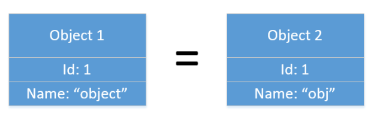
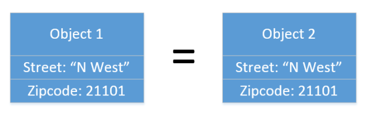

# [译文] 实体与值对象相同吗? (Is Entity the same as Value Object?)

[原文: *Is Entity the same as Value Object?*](https://enterprisecraftsmanship.com/posts/is-entity-same-as-value-object/)

> In this post, we’ll discuss an interesting question about whether the concepts of Entity and Value Object are the same.

在这篇文章中, 我们将讨论一个有趣的问题, 关于实体与值对象的概念是否相同.

> I wrote a lot about entities and value objects. Here’s the go-to post if you need to learn more about what they are and the differences between them: [Entity vs Value Object: the ultimate list of differences](https://enterprisecraftsmanship.com/posts/entity-vs-value-object-the-ultimate-list-of-differences/). And to this date, I find interesting angles to look at these concepts from.

我写了一堆关于实体和值对象的文章. 如果你需要了解它们是什么以及它们之间的区别, 可参考下这篇文章: *[实体 vs 值对象: 终极差异清单](https://enterprisecraftsmanship.com/posts/entity-vs-value-object-the-ultimate-list-of-differences/)*. 到目前为止, 我发现了一些有趣的角度来探索这些概念.

> This one comes from Panos Kousidis who asked a insightful question in the comments to [one of my posts about value objects](https://enterprisecraftsmanship.com/posts/value-object-better-implementation/):

这个问题来源于 Panos Kousidis, 他在我的一篇 *[关于值对象的一篇文章](https://enterprisecraftsmanship.com/posts/value-object-better-implementation/)* 的评论中提出了一个极为深刻的问题:

> *Can we consider an "Entity" as a "ValueObject" that compares only its Id for equality? Can this result in defining the base entity class as*

*我们是否可以考虑将 `实体` 视作为 `值对象`, 仅比较它们的 `Id` 是否相等? 可否将实体基类定义为*:

```csharp
public abstract class Entity : ValueObject
{
   public int Id { get; protected set; }

   protected override IEnumerable<object> GetEqualityComponents()
   {
       yield return Id;
   }
}
```

> This is a deep question which doesn’t have a quick answer, so let’s break it down into two parts. Here’s what differentiates entities from value objects (again, taken from [this article](https://enterprisecraftsmanship.com/posts/entity-vs-value-object-the-ultimate-list-of-differences/)):

这是个很难回答的问题, 所以我们将其分为两部分. 这里有关于实体和值对象区别的文章(还是这里, 取自 *[这篇文章](https://enterprisecraftsmanship.com/posts/entity-vs-value-object-the-ultimate-list-of-differences/)*):

> - Identity comparison

- 标识符比较.

> - Immutability

- 不可变性.

> - History preservation*

- 历史维持*.

(译者注: History preservation, 历史维持. 这个翻译是 *[茶姨](https://github.com/alexinea)* 提供的, 我在 *领域驱动设计：软件核心复杂性应对之道（修订版）* 并没找到对应翻译, 还可译为 "历史保存", 大概意思是实体的状态变更的记录将会保存下来.)

> Let’s review the treatment of entities as value objects with regards to each of these two items.

让我们重新看下, 将实体视为值对象的处理方法, 其中涉及到这两项 (作者指的是 `实体` 和 `值对象`) 中的每一项.

## 标识符比较 (Identity comparison)

> **Identity comparison** defines how two instances of a class compare to each other.

**标识符比较** 定义类的两个实例如何相互比较彼此.

> Entities are compared by their identifiers. Two objects are deemed equal if they have the same Id:

实体通过它们的标识符在彼此之间进行比较. 对于两个对象, 若他们拥有相同的 Id, 则被认为是相等的.



**Identifier equality (标识符的相等)*

> Value objects are compared by their content. Two value objects are deemed the same if their contents match:

值对象则根据他们的内容去比较. 若两个值对象的内容完全相同, 则被认为相等.



**Structural equality (结构的相等)*

> Note that although you usually compare value objects by **all** of their contents, it doesn’t have to always be the case. Some fields might not matter for identity comparison.

注意, 尽管通常通过值对象的内容比较来比较他们, 但可不一定总是这样. 某些字段在比较标识符的时候可能并不重要.

> An example is the `Error` class I brought up in a [recent article](https://enterprisecraftsmanship.com/posts/advanced-error-handling-techniques/):

一个例子是这个我在 *[最近的一篇文章](https://enterprisecraftsmanship.com/posts/advanced-error-handling-techniques/)* 中提到的 `Error` 类:

```csharp
public sealed class Error : ValueObject
{
    public string Code { get; }
    public string Message { get; }

    internal Error(string code, string message)
    {
        Code = code;
        Message = message;
    }

    protected override IEnumerable<object> GetEqualityComponents()
    {
        yield return Code; // the only field used for comparison (唯一用于比较的字段).
    }
}
```

> This class contains two fields:

此类包含两个字段 (此处有争议, 上文代码里应为`属性`, 但作者在此文中经常混用 `field(字段)` 和 `property(属性)`):

> - `Code` — this is what defines an error,
> - `Message` — for additional debug information just for developers.

- `Code` —  这个定义了错误码,
- `Message` —  仅为开发者附加的调试信息.

> If you pass errors to external systems, those systems shouldn’t ever bind to error messages, only to their codes. This is why the `Error` class uses only the `Code` field for identity comparison: changes in debug messages don’t matter; two errors with the same code are treated as the same error even if their messages differ.

如果你将错误 (`Error`) 传递给外部系统, 那么这些系统不应该与错误信息 (`Message`) 绑定, 而应该仅仅绑定到给他们错误码 (`Code`). 这就是为什么 `Error` 类仅使用 `Code` 字段作为标识符比较: 调试信息的变化无关紧要. 具有相同错误码的两个错误被认为是相同的错误, 即使它们的消息不同.

> This is where Panos Kousidis' question comes from too. If you can exclude some fields from a value object’s identity comparison, can you also exclude all of them (except for the Id) and end up with the code like the following?

这也就是 Panos Kousidis 的问题根源. 如果你能从值对象的标识符比较中排除一些字段, 那么是否还能排除除了 Id 之外所有字段, 直到它们的类似于下面的代码?

```csharp
public abstract class Entity : ValueObject
{
    public int Id { get; protected set; }

    protected override IEnumerable<object> GetEqualityComponents()
    {
        yield return Id;
    }
}

public class Customer : Entity
{
    public string Name { get; protected set; }
    public string Email { get; protected set; }
}
```

> You definitely can, I don’t see any reason why not. So, from the identity comparison perspective, the answer to the question "*Can you treat Entity and Value Object as the same concept?*" is **yes**.

你完全可以这么做, 我看不出来有什么理由不可以. 因此, 从标识符比较的视角, "*是否可以将实体和值对象视为相同的概念?*" 的答案是 "**YES**".

## 不可变性 (Immutability)

> In terms of immutability, the difference between entities and value object is that value objects are immutable, whereas entities are almost always mutable. You don’t modify a value object; instead, you create a new one and replace the old instance with it.

在不可变性上, 实体与值对象的区别在于值对象是不可变的, 而实体几乎总是可变的. 不需要修改值对象; 而是创建一个值对象的新实例去替换旧实例.

> One could argue that immutability isn’t a defining property of a value object either. You could even apply the same line of reasoning as with **identity comparison** and say that what matters is immutability of the fields that form the value object’s identity, and that all other fields can be left mutable. In the example with the `Error` class, that would mean being able to change the `Message` field, but not `Code`.

有人可能会说, 不可变性也不是值对象的属性定义. 你甚至可以应用同样的推理作为 **标识符比较**, 并说重要的是构成值对象的标识符字段的不可变性, 而其它所有的字段可以保持可变的. 在 `Error` 类的示例中, 意味着可以修改 `Message` 字段, 但是不能修改 `Code` 字段.

> And it’s true that fields that form the object’s identity must not change. This requirement works similarly for entities and value objects:

的确, 构成对象的标识符字段不能变更, 这一要求同样适用于实体和值对象:

> - The modification of an entity’s Id field would turn that entity into a different one. Thus, such a modification is prohibited.

- 修改实体的 Id 字段会将该实体变成另外一个实体. 因此, 这种修改是被禁止的.

> - Similarly, the modification of fields that form a value object’s identity would, too, turn that value object into a different one.

- 同样地, 对构成值对象的标识符字段修改也会将该值对象转变成另外一个不同的值对象.

> But what about the remaining fields? If we can change an entity’s properties (except for the Id one), can’t we also change the fields of a value object, as long as they aren’t part of its identity?

但是剩余其它的字段呢? 如果我们能改变一个实体除 `Id` 外的属性, 那么我们是否也可以修改值对象的字段, 只要这些字段不是值对象标识符的一部分?

> On the surface, it looks like we can, but this line of reasoning falls apart when you take into account the 3rd component that differentiates entities from value objects: history preservation.

从表面上看, 我们好像可以这样子做, 但是当考虑到实体与值对象的第三个区别: **历史维持** 时, 这种推理就经不起推敲了.

## 历史维持 (History preservation)

> **History preservation** is whether or not an object has a history in your domain model.

**历史维持** 指的是对象在域模型中是否具有历史记录.

> Entities have such a history (even though you might not store it explicitly). In other words, entities *live in a continuum*: they are created, modified, and deleted — all at different points in time. Value objects don’t have a history; they are a mere snapshot of some state.

实体就具有这样的历史记录 (即使你可能没有显示地存储它). 换句话说, 实体是连续存在的: 它们在不同的时间点被创建, 修改和删除. 值对象没有历史, 它们仅仅是某些状态的快照.

> The modification of a value object implicitly extends its lifetime beyond just being a snapshot. Such a modification assumes the value object also has a history, which goes against the requirement of not preserving history in value objects.

值对象的修改隐式地延长了其生存期, 而不仅仅是作为快照. 这样的修改假设值对象也具有历史记录, 但是这违反了值对象中不保留历史记录的要求.

> History preservation is what answers the question of "*Can you treat Entity and Value Object as the same concept?*". That answer is **no**.

历史维持是对 "`可以将实体对象和值对象视为同一个概念?`" 这一问题的回答, 答案是否定的.

## 总结 (Summary)

> The answer to the question of "Can we consider an entity as a value object that compares only its Id for equality?" boils down to three parts:

"*我们是否可以考虑将 `实体` 视作为 `值对象`, 仅比较它们的 `Id` 是否相等?*" 这个问题的回答可以归结为三个部分:

> - In terms of **identity comparison**, the answer is **yes**.

- 就比较标识符而言, 答案是**可以**.

> - In terms of **immutability**, the answer is **yes**.

- 就不可变性而言, 答案是**可以**.

> - In terms of **history preservation**, the answer is **no**.

- 就历史维持而言, 答案是**不能**.

> Thus, the overall answer is also **no**.

因此, 总的答案也是**不能的**.
